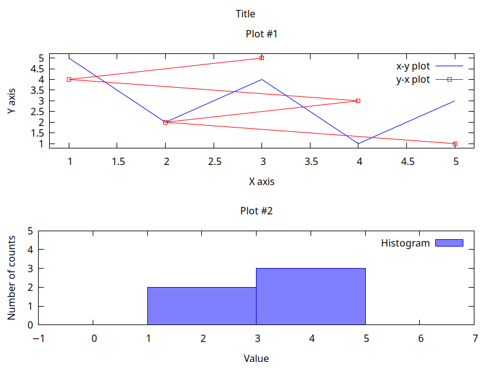
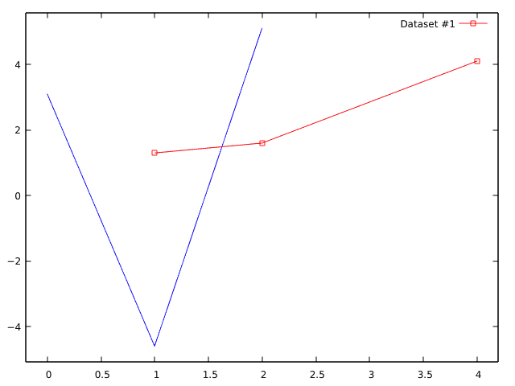
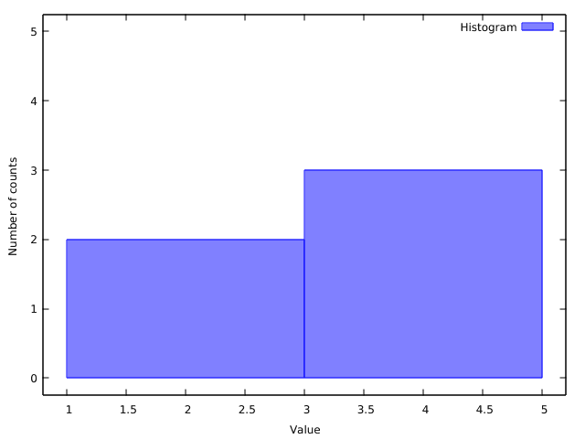
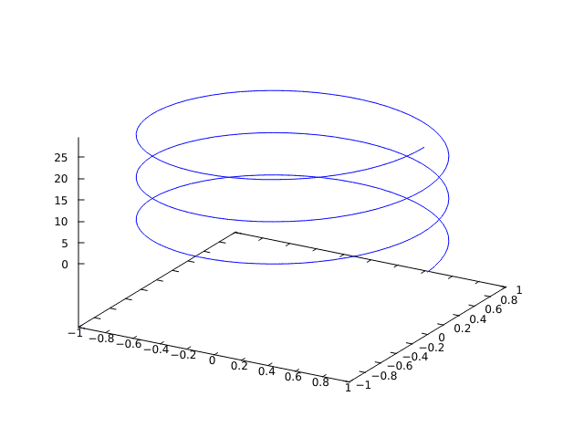
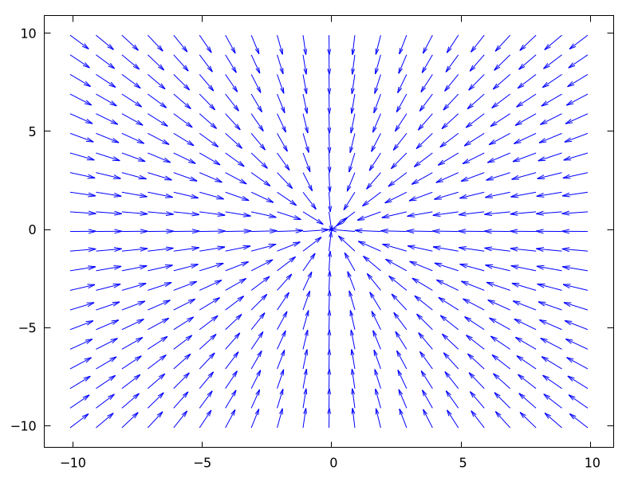
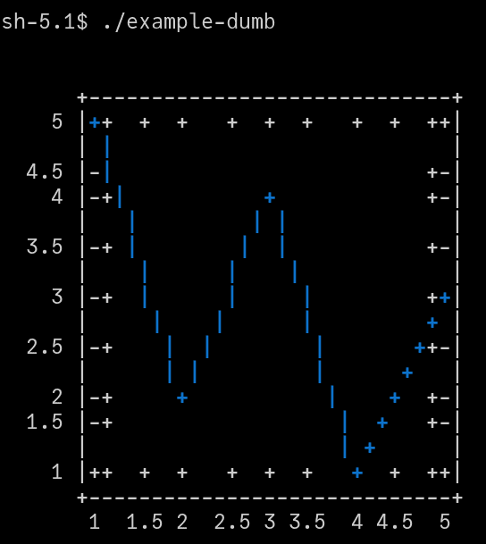

# gplot++

[](https://github.com/ziotom78/gplotpp/actions?query=workflow%3Amake-checks)
[](https://opensource.org/licenses/MIT)

A header-only C++ interface to Gnuplot. See [this video](https://vimeo.com/638098854) for a demo (running Visual Studio under Windows 10).

This repository contains the file [gplot++.h](https://raw.githubusercontent.com/ziotom78/gplotpp/master/gplot%2B%2B.h), which provides a way for C++ programs to connect to a Gnuplot instance to produce plots. To use this library, you must first install [Gnuplot](http://www.gnuplot.info/) on your system!

A few features of this library are the following:

- Header-only library: very easy to install
- Plot `std::vector` variables
- Multiple series in the same plot
- Multiple plots (via `Gnuplot::multiplot`)
- Logarithmic axes (via `Gnuplot::set_logscale`)
- Histograms (via `Gnuplot::histogram`)
- Custom ranges (via `Gnuplot::set_xrange` and `Gnuplot::set_yrange`)
- Possibility to save the plots in PNG and PDF files
- 3D plots (**new in 0.2.0**)


# Table of Contents

* [gplot++](#gplot)
* [Table of Contents](#table-of-contents)
   * [Installing Gnuplot and gplot++.h](#installing-gnuplot-and-gploth)
      * [Windows](#windows)
      * [Linux](#linux)
      * [Mac OS X](#mac-os-x)
      * [Installing gplot++.h](#installing-gploth)
   * [Examples](#examples)
   * [Documentation](#documentation)
      * [Initializing a connection to Gnuplot](#initializing-a-connection-to-gnuplot)
      * [Plot commands](#plot-commands)
      * [Histograms](#histograms)
      * [Line styles](#line-styles)
      * [Styling the plot axes](#styling-the-plot-axes)
      * [Logarithmic scale](#logarithmic-scale)
      * [Multiple plots](#multiple-plots)
      * [Error bars](#error-bars)
      * [3D plots](#3d-plots)
      * [Vector fields](#vector-fields)
      * [Saving plots to a file](#saving-plots-to-a-file)
      * [Low-level interface](#low-level-interface)
   * [Similar libraries](#similar-libraries)
   * [Changelog](#changelog)
      * [HEAD](#head)
      * [v0.5.1](#v051)
      * [v0.5.0](#v050)
      * [v0.4.0](#v040)
      * [v0.3.1](#v031)
      * [v0.3.0](#v030)
      * [v0.2.1](#v021)
      * [v0.2.0](#v020)
      * [v0.1.0](#v010)

Created by [gh-md-toc](https://github.com/ekalinin/github-markdown-toc)


## Installing Gnuplot and `gplot++.h`

Of course, before using `gplot++.h` you must have Gnuplot installed and available in the `PATH`! We provide here instructions about how to install Gnuplot under Windows, Mac OS X, and Linux. 

**Windows users, beware that the standard installation won't work with `gplot++.h` because you need to activate a flag during the installation!**

### Windows

Download the Gnuplot installer from the [SourceForge website](https://sourceforge.net/projects/gnuplot/files/gnuplot/). Be sure not to download the `.tar.gz` file; instead, you should download the file ending with `.exe`, e.g., [gp542-win64-mingw.exe](https://sourceforge.net/projects/gnuplot/files/gnuplot/5.4.2/gp542-win64-mingw.exe/download).

When you run the installer, pay attention to the option *Add application directory to your PATH environment variable* while installing Gnuplot, otherwise **`gplot++.h` will fail to generate the plots**! See [this video](https://vimeo.com/638098416) for help.

### Linux

Linux users should use their package manager to install Gnuplot:

    # Debian, Ubuntu, Linux Mint
    sudo apt-get install gnuplot
    
    # Arch, Manjaro
    sudo pacman -Syu gnuplot
    
    # Fedora
    sudo dns install gnuplot

### Mac OS X

The preferred way to install Gnuplot is using [Homebrew](https://formulae.brew.sh/formula/gnuplot) from the terminal:

    brew install gnuplot

### Installing `gplot++.h`

Once you have Gnuplot installed, download the file [gplot++.h](https://raw.githubusercontent.com/ziotom78/gplotpp/master/gplot%2B%2B.h) and save it in the same folder as your program. That's all.

[This video](https://vimeo.com/638098854) shows how to include [gplot++.h](https://raw.githubusercontent.com/ziotom78/gplotpp/master/gplot%2B%2B.h) in a C++ project created using Visual Studio 2019 (Windows).

## Examples

Here is the output of one of the examples:



The source code of the example is in file `example-complex.cpp`:

```c++
#include "gplot++.h"

int main(void) {
  Gnuplot plt{};
  std::vector<double> x{1, 2, 3, 4, 5}, y{5, 2, 4, 1, 3};

  // Save the plot into a PNG file with the desired size (in pixels)
  plt.redirect_to_png("complex.png", "800,600");

  /* Create two plots with the following layout (2 rows, 1 column):
   *
   * +------------------------+
   * |                        |
   * |        Plot #1         |
   * |                        |
   * +------------------------+
   * |                        |
   * |        Plot #2         |
   * |                        |
   * +------------------------+
   */
  plt.multiplot(2, 1, "Title");

  // Plot #1
  plt.set_title("Plot #1");
  plt.set_xlabel("X axis");
  plt.set_ylabel("Y axis");
  plt.plot(x, y, "x-y plot");
  plt.plot(y, x, "y-x plot", Gnuplot::LineStyle::LINESPOINTS);
  plt.show(); // Always call "show"!

  // Plot #2
  plt.set_title("Plot #2");
  plt.set_xlabel("Value");
  plt.set_ylabel("Number of counts");
  plt.histogram(y, 2, "Histogram");
  plt.set_xrange(-1, 7);
  plt.set_yrange(0, 5);
  plt.show(); // Always call "show"!
}
```

## Documentation

### Initializing a connection to Gnuplot

The only symbol exported by file `gplot++.h` is the `Gnuplot` class. When you instance an object of this class, it will silently start `gnuplot` in the background and open a pipe through it:

```c++
#include "gplot++.h"

int main() {
    Gnuplot plt{};
    
    // ...
}
```

If Gnuplot is not available in your `PATH` (probably this is most common on Windows system), you can specify the full path to the executable:

```c++
#include "gplot++.h"

int main() {
    Gnuplot plt{R"(C:\Program Files\Gnuplot\gnuplot.exe)"};
    
    // ...
}
```

The connection will be automatically closed once the variable `plt` goes out of scope; by default, the Gnuplot window will be left open. In this way, you can navigate through the Gnuplot window even after your C++ has completed its execution.

### Plot commands

There are two ways to produce a plot; both require you to call the `Gnuplot::plot` method:

1. Pass one `std::vector` variable, which will be used to set the `y` coordinates of the points;
2. Pass two `std::vector` variables; these will be used to set the `(x, y)` coordinates of the points.

You can call `plot` multiple times, and each time your call will be recorded in a list. When you are ready to produce a plot, call `Gnuplot::show`, like in the following example:

several ways to produce a plot. Each of them requires you to pass the data to plot through one or more `std::vector` variables:

```c++
std::vector<int> x{1, 2, 4};  // No problem to use a vector of ints
std::vector<double> y1{3.1, -4.6, 5.1};
std::vector<double> y2{1.3, 1.6, 4.1};

Gnuplot plt{};
// Just pass the set of y values
plt.plot(y1);

// You can provide a label and a linestyle
plt.plot(x, y2, "Dataset #1", Gnuplot::LineStyle::LINESPOINTS);

// Now produce the plot
plt.show();
```



**New in version 0.7.0**: Instead of providing the two vectors, you can call `Gnuplot::add_point()` repeatedly and then call `Gnuplot::plot()` without specifying vectors. See the example program [example-addpoint.cpp](https://github.com/ziotom78/gplotpp/blob/master/example-3d.cpp).


### Histograms

Gplot++ implements the method `Gnuplot::histogram`, which computes the histogram of a series and plot it using Gnuplot. Here is an example (`example-histogram.cpp`):

```c++
#include "gplot++.h"

int main(void) {
  Gnuplot gnuplot{};
  std::vector<double> y{5, 2, 4, 1, 3};

  gnuplot.histogram(y, 2, "Histogram");

  gnuplot.set_xlabel("Value");
  gnuplot.set_ylabel("Number of counts");
  gnuplot.set_xrange(1, 5);
  gnuplot.set_yrange(0, 5);

  gnuplot.show();
}
```



The parameters to `Gnuplot::histogram` are the following:

- A vector containing the values to use in the plot;

- The number of bins to plot (two bins in the example above);

- A label for the plot (optional, default is empty)

- The line style (optional, default is `Gnuplot::LineStyle::BOXES`)


### Line styles

There are several line styles:

-   `Gnuplot::LineStyle::DOTS` (only use this when you have many points);

-   `Gnuplot::LineStyle::LINES` (the default);

-   `Gnuplot::LineStyle::POINTS`;

-   `Gnuplot::LineStyle::LINESPOINTS`;

-   `Gnuplot::LineStyle::STEPS`;

-   `Gnuplot::LineStyle::BOXES` (only used for histograms).

-   `Gnuplot::LineStyle::VECTORS` (only used for 2D and 3D vector fields).


### Styling the plot axes

You can manually assign a range to the X and Y axes using the methods `Gnuplot::set_xlabel` and `Gnuplot::set_ylabel`:

```c++
Gnuplot plt{};

plt.set_xrange(1.5, 3.5);
plt.set_yrange(); // No parameters means automatic axes
```

If you are creating multiple plots (see below), you should probably reset the x and y ranges after each call to `Gnuplot::show`.

You can also provide a label for both axes:

```c++
plt.set_xlabel("Time [s]");
plt.set_ylabel("Speed [cm/s]");
```

### Logarithmic scale

To set a logarithmic scale, use `Gnuplot::set_logscale`:

```c++
Gnuplot plt{};

plt.set_logscale(Gnuplot::AxisScale::LOGXY);
```

Possible parameters are:

- `Gnuplot::AxisScale::LINEAR` (the default);
- `Gnuplot::AxisScale::LOGX`;
- `Gnuplot::AxisScale::LOGY`;
- `Gnuplot::AxisScale::LOGXY`.


### Multiple plots

You can make several plots within the same window using the method `Gnuplot::multiplot`. It accepts the following parameters:

- The number of rows to use;

- The number of columns to use;

- A title (optional, default is no title).

You must paint the several plot in order, and each time you complete one plot you must call `Gnuplot::show`.


### Error bars

Starting from version 0.3.1, `gplot++.h` supports plots with error bars through these functions:

```c++
Gnuplot::plot_xerr(x, y, xerr, label = "");
Gnuplot::plot_yerr(x, y, yerr, label = "");
Gnuplot::plot_xyerr(x, y, xerr, yerr, label = "");
```

Here is an example ([example-errorbars.cpp](./example-errorbars.cpp)):

```c++
#include "gplot++.h"

int main(void) {
  Gnuplot plt{};
  std::vector<double> x{1, 2, 3, 4, 5}, y{5, 2, 4, 1, 3};
  std::vector<double> xerr{0.2, 0.2, 0.1, 0.1, 0.2},
      yerr{0.3, 0.4, 0.2, 0.6, 0.7};

  /* Create four plots with the following layout (2 rows, 2 columns):
   *
   * +------------------------+------------------------+
   * |                        |                        |
   * |        Plot #1         |        Plot #2         |
   * |                        |                        |
   * +------------------------+------------------------+
   * |                        |                        |
   * |        Plot #3         |        Plot #4         |
   * |                        |                        |
   * +------------------------+------------------------+
   */
  plt.multiplot(2, 2, "Title");

  // Plot #1
  plt.set_xlabel("X axis");
  plt.set_ylabel("Y axis");
  plt.plot(x, y, "", Gnuplot::LineStyle::POINTS);
  plt.show(); // Always call "show"!

  // Plot #2: X error bar
  plt.set_xlabel("X axis");
  plt.set_ylabel("Y axis");
  plt.plot_xerr(x, y, xerr);
  plt.show(); // Always call "show"!

  // Plot #3: Y error bar
  plt.set_xlabel("X axis");
  plt.set_ylabel("Y axis");
  plt.plot_yerr(x, y, yerr);
  plt.show(); // Always call "show"!

  // Plot #4: X and Y error bars
  plt.set_xlabel("X axis");
  plt.set_ylabel("Y axis");
  plt.plot_xyerr(x, y, xerr, yerr);
  plt.show(); // Always call "show"!
}
```


### 3D plots

You can create 3D plots using the command `plot3d`, which takes *three* vectors. See the file `example-3d.cpp`:

```c++
#include "gplot++.h"
#include <cmath>
#include <iostream>

int main(void) {
  Gnuplot gnuplot{};
  std::vector<double> x, y, z;

  for (double angle = 0; angle < 6 * M_PI; angle += 0.1) {
    x.push_back(cos(angle));
    y.push_back(sin(angle));
    z.push_back(angle / 2 * M_PI);
  }

  gnuplot.plot3d(x, y, z);
  gnuplot.show();
}
```

Here is the result:




### Vector fields

Starting from version 0.4.0, gplot++ supports vector field plots, both in 2D and 3D, through the methods `Gnuplot::plot_vectors` and `Gnuplot::plot_vectors3d`:

```c++
#include "gplot++.h"
#include <cmath>
#include <vector>

using namespace std;

int main(void) {
  Gnuplot gnuplot{};

  vector<double> x{}, y{};
  vector<double> vx{}, vy{};

  // Sample a regular grid. Use a small tilt to avoid sampling
  // the grid at the origin
  for (double cur_x{-10.1}; cur_x <= 10; cur_x += 1) {
    for (double cur_y{-10.1}; cur_y <= 10; cur_y += 1) {
      x.push_back(cur_x);
      y.push_back(cur_y);

      double r{sqrt(pow(cur_x, 2) + pow(cur_y, 2))};
      double cur_vx{-cur_x / r};
      double cur_vy{-cur_y / r};
      vx.push_back(cur_vx);
      vy.push_back(cur_vy);
    }
  }

  gnuplot.plot_vectors(x, y, vx, vy);
  gnuplot.show();
}
```




### Saving plots to a file

It is often useful to save the plot into a file, instead of opening a window. You can save plots in PNG format if you call the method `Gnuplot::redirect_to_png`:

```c++
Gnuplot plt{};

// Call this immediately after you constructed the object "plt"
plt.redirect_to_png("image.png", "800,600");
```

The first parameter is the name of the image file to create, and the second is a string specifying the size of the image, in the format `width,height` (in pixels). If you avoid passing the second parameter, a sensible default will be used:

```c++
Gnuplot plt{};

// Use the default size
plt.redirect_to_png("image.png");
```

You can save the plot in a PDF file, which should be the preferred format if you plan to include the plot in a LaTeX document:

```c++
Gnuplot plt{};

// Call this immediately after you constructed the object "plt"
plt.redirect_to_pdf("image.pdf", "20cm,15cm");
```

Unlike `Gnuplot::redirect_to_png`, when you create a PDF file you can use several measure units to specify the size of the image. In this case too, you can avoid passing the second parameter, and a reasonable default will be used.

You can save the plot in a SVG file via the method `Gnuplot::redirect_to_svg`. In this case, the SVG file will be interactive when opened in a web browser.

Finally, you can use `Gnuplot::redirect_to_dumb` to send the plot to the terminal or to a text file. You can pass a `Gnuplot::TerminalMode` value to specify if you want to include ANSI escape codes to produce colors, as shown in [`example-dumb.cpp`](example-dumb.cpp):



### Low-level interface

You can pass commands to Gnuplot using the method `Gnuplot::sendcommand`:

```c++
Gnuplot plt{};

plt.sendcommand("set xlabel 'X axis'");
plt.sendcommand("plot sin(x)");
```

## Similar libraries

There are several other libraries like gplot++ around. These are the ones I referenced while developing my own's:

-   [gnuplot-iostream](https://github.com/dstahlke/gnuplot-iostream): it has much more features than gplot++, but it is slightly more difficult to install and use.
-   [gnuplot-cpp](https://github.com/martinruenz/gnuplot-cpp): another header-only library. It lacks support for high-level stuff like `std::vector` plotting.

## Changelog

### HEAD

### v0.7.0

-   Add `Gnuplot::add_point`, `Gnuplot::get_num_of_points()`, `Gnuplot::get_points_x()`, and `Gnuplot::get_points_y()`, as well as a new overloaded method `Gnuplot::plot()` which does not require the vectors of `x` and `y`.

### v0.5.1 (a.k.a. 0.6.0)

-   Add `Gnuplot::set_title`

### v0.5.0

-   Add `redirect_to_dumb` and the `TerminalType` enum class to support the `dumb` terminal

-   Use a smarter algorithm to specify ranges in `Gnuplot.set_xrange` and `Gnuplot.set_yrange`: now specifying one of the two extrema as `NAN` does not override the specification of the other.

### v0.4.0

-   `Gnuplot::redirect_to_svg` has been added

-   `Gnuplot::plot_vectors`, `Gnuplot::plot_vectors3d` have been added

### v0.3.1

-   `Gnuplot::plot_xerr`, `Gnuplot::plot_yerr`, and `Gnuplot::plot_xyerr` have been added

### v0.3.0

-   The library is now supported under Windows

### v0.2.1

-   Ensure that commands sent to Gnuplot are executed immediately ([#1](https://github.com/ziotom78/gplotpp/pull/1))

### v0.2.0

-   New constants `GNUPLOTPP_VERSION`, `GNUPLOTPP_MAJOR_VERSION`, `GNUPLOTPP_MINOR_VERSION`, and `GNUPLOTPP_PATCH_VERSION`

-   3D plots (after a suggestion by William Luciani)

### v0.1.0

-   First release
